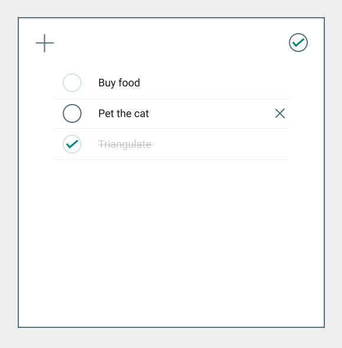

# To Do List

### Specifications

- [X] Create design mockup using Figma
- [X] Learn how to setup and use React
- [X] Deepen understanding of Express
- [X] Postgres database
- [X] Responsive design

As a user, I can manipulate tasks in the following ways:
- [X] Create
- [X] Edit
- [X] Delete
- [X] Check off as complete

#### Stretch goals
- [X] Rearrange tasks by dragging
- [ ] Deploy to Heroku

#### Design mockup

#### Routes
| Path            | Method | Action             |
| --------------- | ------ | ------------------ |
| /               | get    | getAll()           |
| /add            | post   | add()              |
| /complete/:id   | put    | markAsComplete()   |
| /incomplete/:id | put    | markAsIncomplete() |
| /edit/:id       | put    | edit()             |
| /delete/:id     | delete | remove()           |
| /reorder        | put    | reorder()          |
